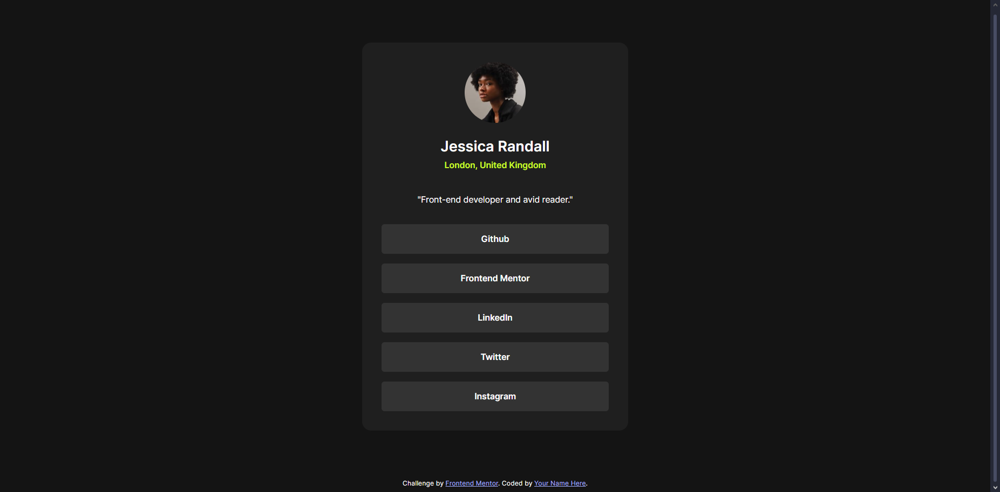

# Frontend Mentor - Social links profile solution

This is a solution to the [Social links profile challenge on Frontend Mentor](https://www.frontendmentor.io/challenges/social-links-profile-UG32l9m6dQ). Frontend Mentor challenges help me improve my coding skills by building realistic projects. 

## Table of contents

- [Overview](#overview)
  - [The challenge](#the-challenge)
  - [Screenshot](#screenshot)
  - [Links](#links)
- [My process](#my-process)
  - [Built with](#built-with)
  - [What I learned](#what-i-learned)
- [Author](#author)

## Overview

### The challenge

Users should be able to:

- See hover and focus states for all interactive elements on the page

### Screenshot

### Links

- Solution URL: [github.com/RayyanNafees/fm-lvl-2](https://github.com/RayyanNafees/fm-lvl-2)
- Live Site URL: [rayyannafees.github.io/fm-lvl-2](https://rayyannafees.github.io/fm-lvl-2)

## My process

### Built with

- Semantic HTML5 markup

### What I learned
I learnt how to make static pages in speed & separation of concern regarding different CSS files

- I learnt the `margin-inline:auto` property in CSS to center block elements
- I learnt the `margin-block:auto` property in CSS to center inline elements vertically

## Author

- Website - [Rayyan Nafees](https://rayyannafees.github.io)
- Frontend Mentor - [@RayyanNafees](https://www.frontendmentor.io/profile/RayyanNafees)
- Twitter - [@NafeesRayyan](https://www.twitter.com/NafeesRayyan)
